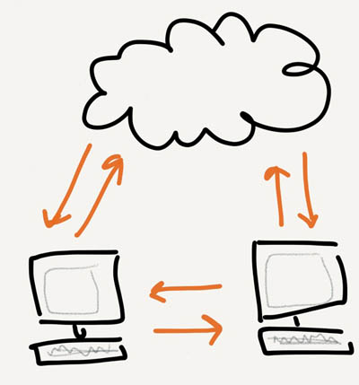
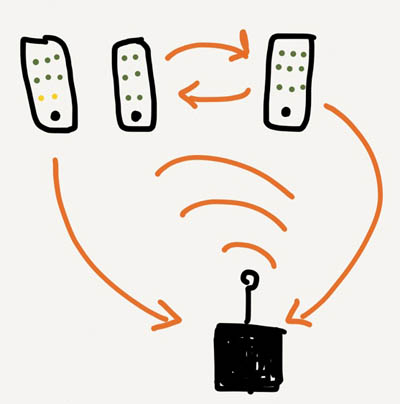
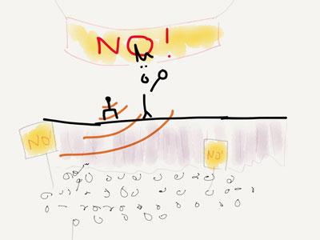

# Use Cases

## Cloud Syncing

A desktop PC user navigates to a remote peoples-lib via URL.  The visitor is able to view, search, consume and sync any files in the remote library.  Synced files are stored in the browser for offline use. They can also be downloaded to the PC file system.  The visitor is able to see other visitors currently in the library and sync with them peer-to-peer using webRTC.

## Guerilla Public Libraries

A raspberry pi or openWRT router running The People's Library is plugged into an out-of-the-way outlet inside a physical public library (or cafe, supermarket, park...).  The device appears as an open wireless access point that allows all connected to view, search, consume and sync (in either direction, creating a free & local space for public exchange).

## Seamless Sharing

Two devices containing The People's Library could locate each other and sync automatically.  A Protest organizer might create a library with relevant literature & propaganda allowing protestors to set their libraries to openly sync.

## Private Collections

By collecting and enjoying our material culture, we also become its steward. An anecdote: While waiting for his date to come downstairs from preparing for the evening's events, a young suitor uses his smart phone to peruse his date's father's audio collection.  Discovering one of his favorite [obscure bands](http://open.spotify.com/artist/5awyxT5dfxGoIIG6zuvxLv) in the father's collection emboldens him to strike up a conversation.  Improbably, the band is also one of the father's all-time favorites too!  Hearts are warmed and a father's mild approval is won.

## Lending Libraries

_"It is all well and good to copy and share works that fall outside copyright. But what about stealing?!"_

Should it be the case that you hold yourself to a particularly severe intelectual property regime you might consider a lending library.  As it stand now, it is not easy (if it is even possible) to lend a digital book to someone.  However, configuring your library as a lending library would facilitate this.  Your lending library would behave like so:  You would make a selection of works available to browse via a web URL or wireless access point.  If a visitor to your library decides they would like to consume a work you own, they "check it out" for an agreed upon period of time. During that time the work is no longer accessible to you or anyone other than the person who checked it out.  When the time period passes, the work is instantly available to you again and vainishes from their collection.

